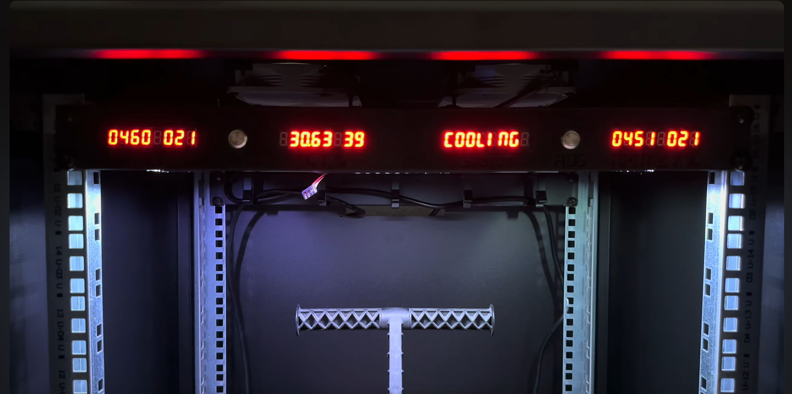
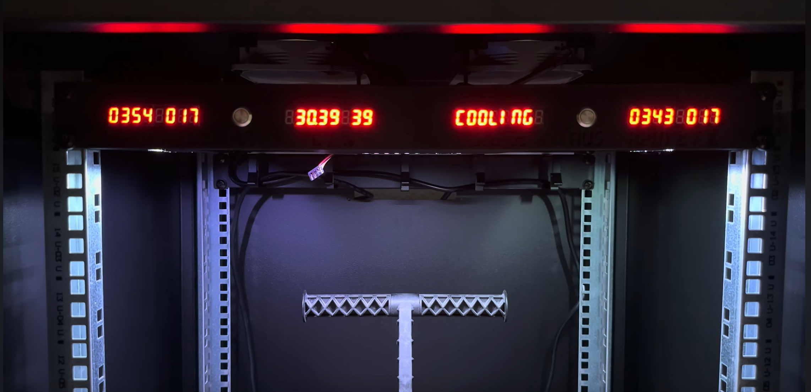
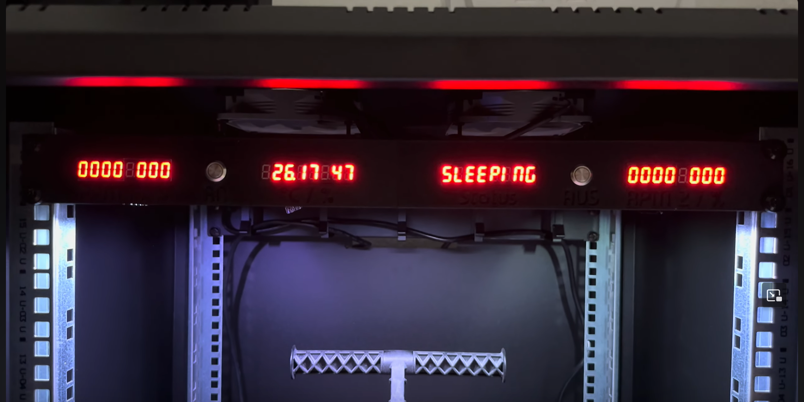
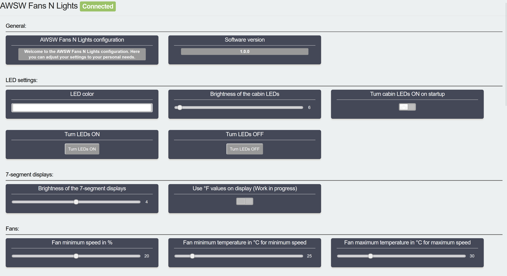
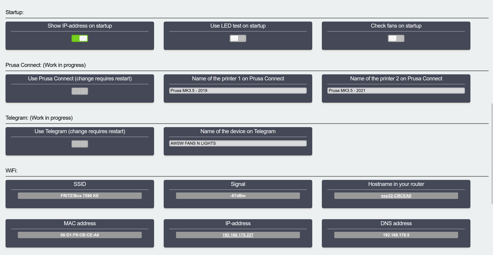
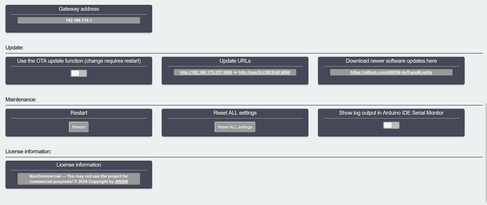
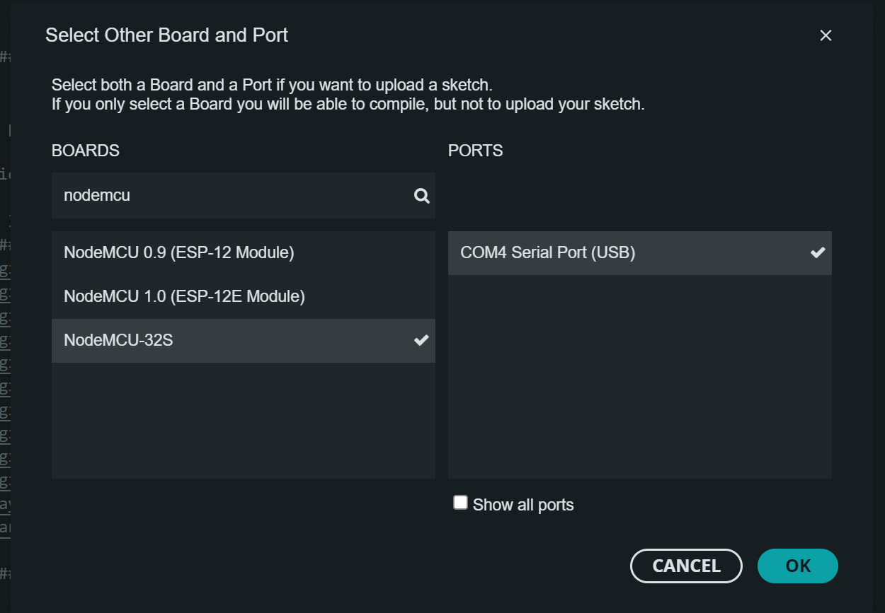
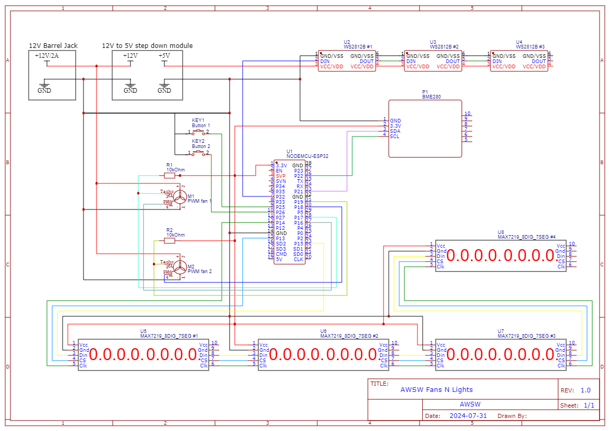
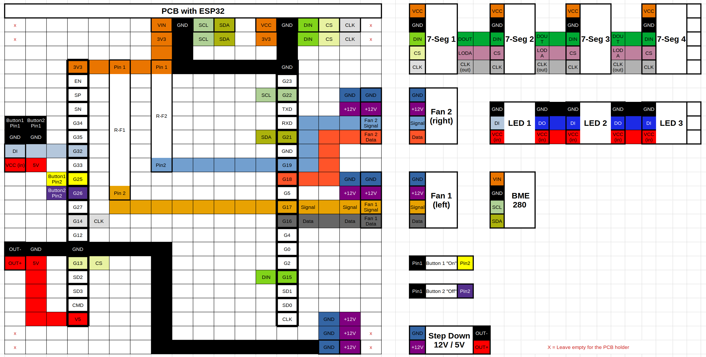
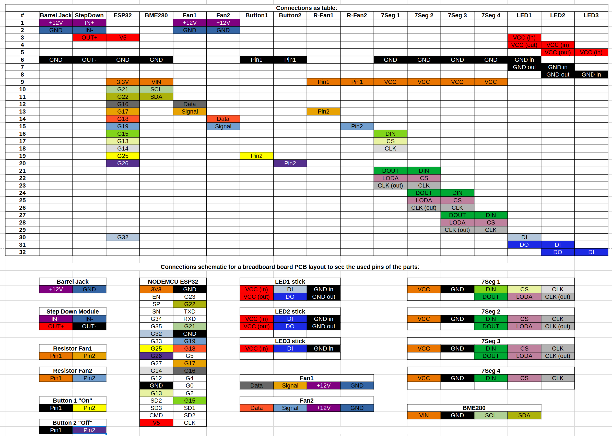

# FansNLights

AWSW Fans N Lights control for 3D printer cases

Code for the <a href="https://www.printables.com/de/model/965765-fans-n-lights-19-3d-printer-cases">AWSW Fans N Lights</a> Project as 3D print on <a href="https://www.printables.com">www.printables.com</a>

Pictures:

Video:

Internal web interface to change setttings of the device:

Programming:
Select the "NODEMCU-32S" as the ESP32 board to upload the code:

Wireing:

Schematic:

Bread board PCB layout:

Connection table:

